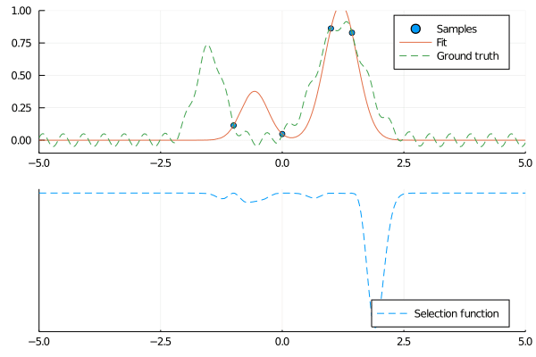
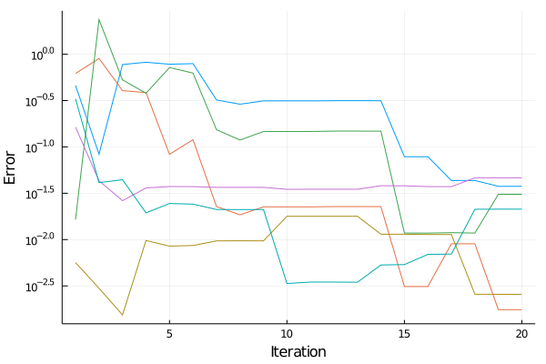

# SequentialFit
## Motivation
If we have an unknown function ``f(x)`` which we can only sample, we can choose
a *known* function ``g(x,p)`` characterized by a parameter vector ``p``.

With the least-squares method, we can find the ``p`` that minimizes the
sum-of-squares error ``\sum_{x\in X}(g(x,p) - f(x))^2`` at a set of sampling
points ``X``. If ``f`` is expensive to evaluate, it would be in our interest to
choose our sampling points carefully. Assuming that our model is already
decent, we can use it to figure out where to sample next.

A guess to what point to sample would be a point ``x^*``where the ``p``-gradient of ``g(x^*,p)`` is as large as possible (that's where we're most likely to learn something from sampling). We also want to avoid sampling many times in the same spot.

This package implements this sequential sampling method.

## Usage example
```julia
using SequentialFit, Plots
gaussian(x,mu,sigma) = exp(-((x-mu)/sigma)^2)
function expensiveFunction(x)
    sleep(2) # This function takes several seconds to run
    gaussian(x,-1.2,0.3) + gaussian(x,0.9,0.7) + 0.1*sin(15*x)
end
@. model(x,p) = gaussian(x,p[1],p[2]) + gaussian(x,p[3],p[4])
x0 = [-1,0,1] # Initial sample points
p0 = [-1,0.5,1,0.5] # Initial guess of parameters
s = SeqFit(expensiveFunction,model,x0,p0)
push!(s,-1.5,1.5) # Sample specific points
update!(s) # Figures out where to sample next, does, and updates the parameters
println(s.fit.param) # The found parameters
plot(s) # Show sampled points and fitted curve. Can also show ground truth with `groundtruth=true`, but this of course doesn't work with slow functions.
```

## Visualization
The script in `doc/example.jl` generates the following figures:





## Selection method
The next point is chosen as an ``x^*`` that minimizes 
`` -\left|\nabla_p g(x,p) \right|^2 \cdot \prod_{x\in X} (x-x^*)^2``

## Disclaimer
I haven't properly done the math on this. There might well be a paper out there that disproves this entire concept. Please let me know why this is wrong and stupid.

## Todo
* Add possibility to supply analytical gradient expression 
* Look into multi-variate stuff
* Stop procrastinating cleaning your apartment
